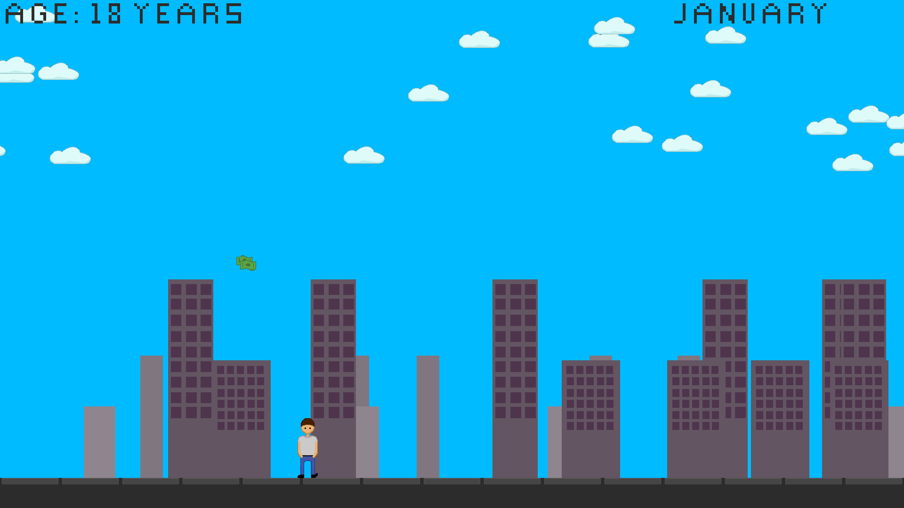
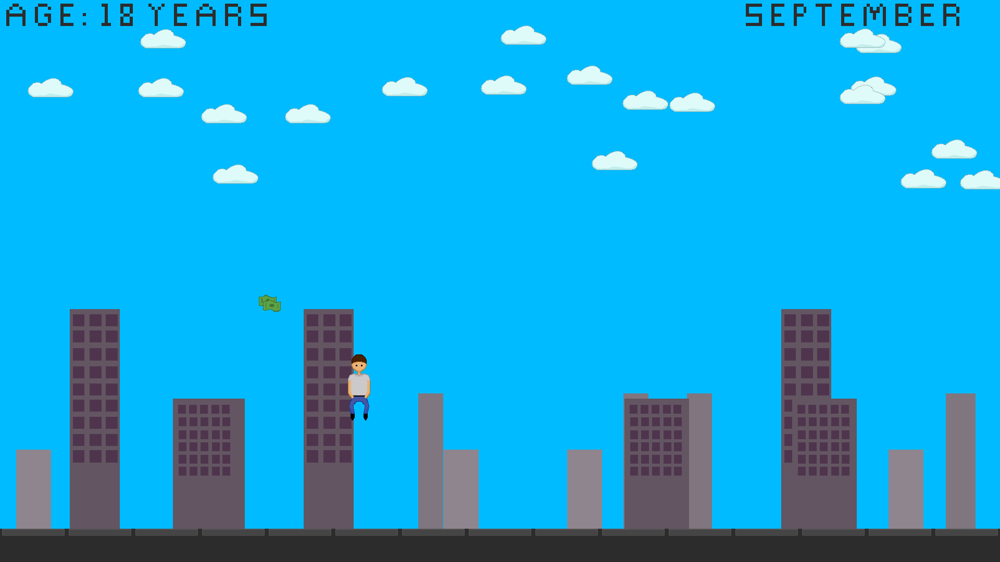

# WELCOME TO MONEY MAN

Money Man is a simple 2D game about capitalism and earning money.
The goal is quite simple jump and move to get your monthly paycheck
to reach your ultimate goal of retiring.

## Download
There are releases on Github for Windows and Linux.

If you download the Linux version, there is a tar-ball available but
would have to make sure that libsdl2, libsdl2-image and libsdl2-ttf
are installed on your system. Otherwise you can use the .deb-package
then it is also possible to start the game by a simple

`money-man`

command.

## Compilation

CMake is used for building Money Man, so it is supposed to work under
windows too.

To build Money Man it is important to have SDL2, SDL2_image, SDL2_ttf,
CMake and a C++-compiler.

### Linux

The building instructions on Debian-based distributions are the following
ones:

`sudo apt install libsdl2-dev libsdl2-image-dev libsdl2-ttf-dev cmake`

`git clone git@github.com:tevoran/money-man.git` 

`cd money-man` 

`mkdir build` 

`cd build` 

`cmake ..` 

`make` 

`./money-man`
